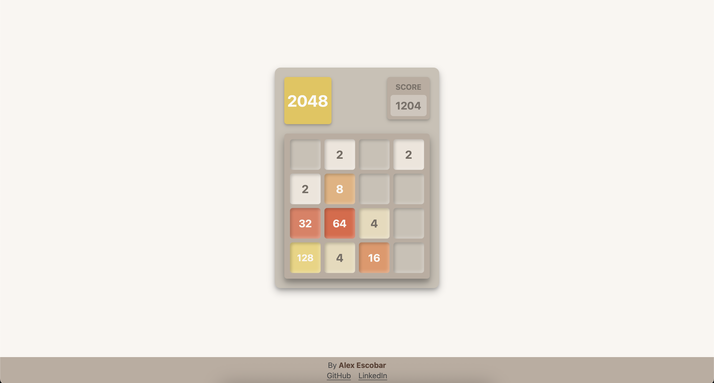

# 2048 Clone



A clone of the famous **2048** game. Built with **React**, **TypeScript**, and **CSS Modules**.
Built as a practice project to learn React and Typescript.

Play the game here: [https://2048-by-alex-e.netlify.app](https://2048-by-alex-e.netlify.app)

## Table of Contents

- [Features](#features)
- [How to Run Locally](#how-to-run-locally)
- [Tech Stack](#tech-stack)
- [Controls](#controls)
- [Game Overview](#game-overview)
- [Author](#author)
- [Future Improvements](#future-improvements)
- [License](#license)

## Features

- Tile movements with animations
- Keyboard controls (WASD / Arrow keys)
- Mobile controls (swipe events)
- Winning / Losing modals with score tracking
- Deployed live on **Netlify**

## How to Run Locally

### 1. Clone the repository:

```bash
git clone https://github.com/alex-escobar-h/2048-clone.git
```

### 2. Navigate into the project directory:

```bash
cd 2048-clone
```

### 3. Install the dependencies:

```bash
npm install
```

### 4. Start the development server:

```bash
npm run dev
```

## Tech Stack

- **React**
- **TypeScript**
- **CSS Modules**

## Controls

| Actions    | Input                             |
| ---------- | --------------------------------- |
| Move Up    | Arrow Up / W key / Swipe Up       |
| Move Down  | Arrow Down / S key / Swipe Down   |
| Move Left  | Arrow Left / A key / Swipe Left   |
| Move Right | Arrow Right / D key / Swipe Right |

## Game Overview

### Winning Conditions

- Merge tiles with the same number to create larger numbers.
- Reach the **2048** tile to win the game.
- Strategy: keep your highest tile in a corner.

### Losing Conditions

- The game ends when no more moves are possible.
- You lose if the grid fills up and you cannot combine any tiles.

## Author

- Alexander Escobar
- [LinkedIn](https://www.linkedin.com/in/alex-h-escobar/)
- [GitHub](https://github.com/alex-escobar-h/)

## Future Improvements

- Add high score
- Dark mode
- Undo functionality
- Merging animation and sound effects

## License

This project is open source and free to use
